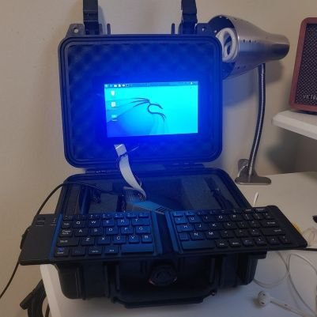

Brey LAUDE, founder and lead information security engineer at Alpha Nerd,  a filipino organization for cybersecurity research and development. Have been in the IT realm for over eight years and have held a variety of positions. 
worked as a oftware developer security researcher/hacker/pentester, software developer, systems developer and security engineer, experienced in cybersecurity, site reliability engineering, distributed computing and software engineering.

### books read
cigarettes - george orwell

the cold start problem - andrew chen

It's Not How Good You Are, It's How Good You Want to Be: The world's best-selling book by Paul Arden by Paul Arden, Roger Kennedy

The Accidental Species: Misunderstandings of Human Evolution by Henry Gee

The Intelligence Trap: Why Smart People Make Dumb Mistakes by David Robson

Unmasking Autism: Discovering the New Faces of Neurodiversity by Devon Price PhD

The Tibetan Book of the Dead: First Complete Translation by Dalai Lama

No Logo: No Space, No Choice, No Jobs by Naomi Klein

Man Alone with Himself by Friedrich Nietzsche

Why I Am So Wise by Friedrich Nietzsche, R. J. Hollingdale (Translator)

The 7 Habits Of Highly Effective People: Revised and Updated : 30th Anniversary Edition by Stephen R. Covey

How to Win Friends and Influence People by Dale Carnegie

Think and Grow Rich by Napoleon Hill

Man's Search For Meaning : The classic tribute to hope from the Holocaust by Viktor E Frankl

12 Rules for Life: An Antidote to Chaos by Jordan B. Peterson

Rich Dad Poor Dad : What the Rich Teach Their Kids About Money That the Poor and Middle Class Do Not! by Robert T. Kiyosaki

The Power of Habit : Why We Do What We Do, and How to Change by Charles Duhigg
Outliers : The Story of Success by Malcolm Gladwell
Thinking, Fast and Slow by Daniel Kahneman
Richest Man In Babylon - Original Edition by George S Clason
Think and Grow Rich : The Original Classic by Napoleon Hill
Sapiens : A Brief History of Humankind by Yuval Noah Harari
The Concise Mastery by Robert Greene
Trust Me I'm Lying : Confessions of a Media Manipulator by Ryan Holiday
On Tyranny : Twenty Lessons from the Twentieth Century by Timothy Snyder
The Courage To Be Disliked : How to free yourself, change your life and achieve real happiness by Ichiro Kishimi, Fumitake Koga
Algorithms to Live By : The Computer Science of Human Decisions by Brian Christian
The Number Devil : A Mathematical Adventure by Hans Magnus Enzensberger
The Man Who Mistook His Wife for a Hat by Oliver Sacks
I, Robot by Isaac Asimov
Brave New World by Aldous Huxley
Politics and the English Language by George Orwell
Hackers & Painters: Big Ideas from the Computer Age by Paul Graham
